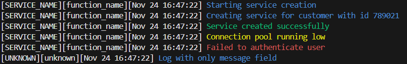
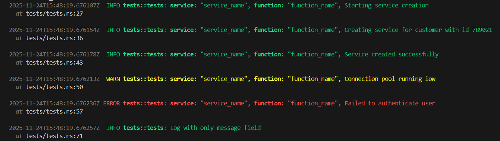
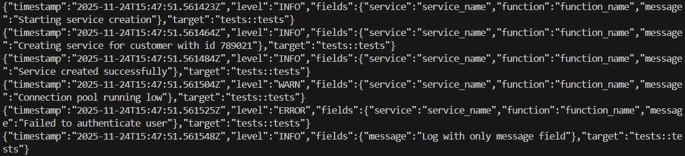

# Coppiot Rust Logger

A flexible and easy-to-use logging library for Rust projects with support for multiple output formats: Human-readable, Debug, and JSON.

## Installation

Add this library to your Rust project using Cargo's Git dependencies feature:

```toml
[dependencies]
coppiot_logger = { git = "ssh://git@github.com/Engapplic/coppiot_logger.git" }
tracing = "0.1"
```

## Usage

### Initialize the Logger

At the start of your application, initialize the logger with your preferred format:

```rust
use coppiot_rust_logger::{init_logging, LogFormat};

fn main() {
    // Initialize with your preferred format
    init_logging(LogFormat::Human);
    
    // Your application code...
}
```

### Logging Messages

Use the standard `tracing` macros to log messages with structured fields:

```rust
use tracing::{info, warn, error};

// Basic log
info!(
    service = "service_name",
    function = "function_name",
    message = "message"
);

// Warning
warn!(
    service = "service_name",
    function = "function_name",
    message = "message"
);

// Error
error!(
    service = "service_name",
    function = "function_name",
    message = "message"
);
```

### Success Messages (Green Highlighting)

In **Human Format**, messages are automatically highlighted in **green** when they contain success keywords. This helps visually identify successful operations:

```rust
// These will appear in green:
info!(
    service = "service_name",
    function = "function_name",
    message = "Service created successfully"
);

info!(
    service = "service_name",
    function = "function_name",
    message = "Service initialized"
);

info!(
    service = "deployment",
    function = "deploy_service",
    message = "Service deployed and ready"
);
```

**Success keywords** (case-insensitive):
- `success`, `succeeded`
- `created`
- `complete`, `completed`
- `finished`
- `done`
- `ready`
- `initialized`
- `connected`
- `deployed`
- `started`

Any message containing these keywords will be displayed in green instead of the default blue.

## Log Formats

### Human Format

Best for local development and easy reading in CloudWatch for humans. Uses a clean `[SERVICE][FUNCTION][TIMESTAMP] Message` format with color coding.

```rust
init_logging(LogFormat::Human);
```



### Debug Format

Rust's pretty format with full metadata including file locations and line numbers. Perfect for debugging.

```rust
init_logging(LogFormat::Debug);
```



### JSON Format

Structured JSON output, best for production environments and machine/AI parsing.

```rust
init_logging(LogFormat::Json);
```



## License

This project is licensed under the Apache License 2.0 - see the [LICENSE](LICENSE) file for details.